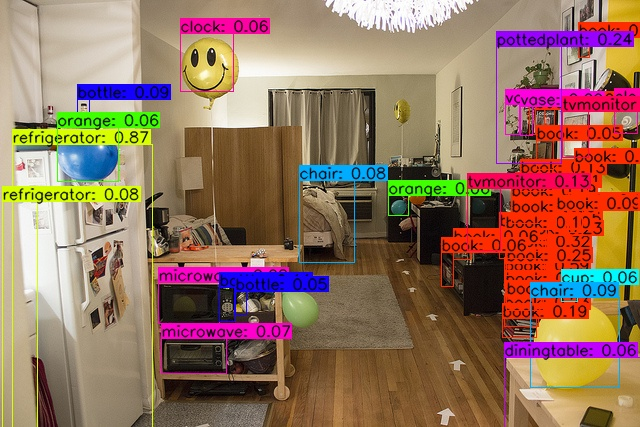

[English](README_en.md) | 简体中文

# Keras-YOLOv4

## 概述
今天是2020.05.20，脱单太难了！

6G的卡也可训练，前提是必须要冻结网络前部分的层。以下是检测效果：



参考自https://github.com/miemie2013/Keras-DIOU-YOLOv3
和https://github.com/Tianxiaomo/pytorch-YOLOv4

## 传送门

Keras版YOLOv3: https://github.com/miemie2013/Keras-DIOU-YOLOv3

Pytorch版YOLOv3：https://github.com/miemie2013/Pytorch-DIOU-YOLOv3

PaddlePaddle版YOLOv3：https://github.com/miemie2013/Paddle-DIOU-YOLOv3

PaddlePaddle完美复刻版版yolact: https://github.com/miemie2013/PaddlePaddle_yolact

yolov3魔改成yolact: https://github.com/miemie2013/yolact

Keras版YOLOv4: https://github.com/miemie2013/Keras-YOLOv4

Pytorch版YOLOv4: 制作中

Paddle镜像版YOLOv4：https://github.com/miemie2013/Paddle-YOLOv4

## 更新日记

2020/05/20:初次见面

2020/06/02:支持训练自定义数据集。

2020/06/05:支持yolact中的fastnms。运行demo_fast.py即可体验。Win10 + cuda9 + 1660Ti(6GB)，用numpy后处理约10FPS，用fastnms约14FPS。

2020/06/08:引入了百度PaddleDetection的数据预处理方式，使得增加数据增强更灵活，代码结构更清晰。所有与train.py相关的配置参数全部放到了config.py里。

2020/06/10:更新Paddle镜像版YOLOv4：https://github.com/miemie2013/Paddle-YOLOv4
，从此GPU不求人，快去AIStudio训练自己的YOLOv4、验证想法吧！

## 需要补充

加入YOLOv4中的数据增强和其余的tricks；更多调优。

## 文件下载
一个没有训练充分的模型step00070000.h5，用6G的卡训练，冻结了conv2d_86之前的层，训练了70000步，

链接：https://pan.baidu.com/s/17R9pmdsxLo2cx-0M-EVfyg 
提取码：ib2u

下载好之后，运行eval.py得到该模型的mAP（input_shape = (608, 608)，分数阈值=0.001，nms阈值=0.45的情况下）：
```
Average Precision  (AP) @[ IoU=0.50:0.95 | area=   all | maxDets=100 ] = 0.373
Average Precision  (AP) @[ IoU=0.50      | area=   all | maxDets=100 ] = 0.605
Average Precision  (AP) @[ IoU=0.75      | area=   all | maxDets=100 ] = 0.394
Average Precision  (AP) @[ IoU=0.50:0.95 | area= small | maxDets=100 ] = 0.212
Average Precision  (AP) @[ IoU=0.50:0.95 | area=medium | maxDets=100 ] = 0.406
Average Precision  (AP) @[ IoU=0.50:0.95 | area= large | maxDets=100 ] = 0.508
Average Recall     (AR) @[ IoU=0.50:0.95 | area=   all | maxDets=  1 ] = 0.296
Average Recall     (AR) @[ IoU=0.50:0.95 | area=   all | maxDets= 10 ] = 0.475
Average Recall     (AR) @[ IoU=0.50:0.95 | area=   all | maxDets=100 ] = 0.509
Average Recall     (AR) @[ IoU=0.50:0.95 | area= small | maxDets=100 ] = 0.334
Average Recall     (AR) @[ IoU=0.50:0.95 | area=medium | maxDets=100 ] = 0.548
Average Recall     (AR) @[ IoU=0.50:0.95 | area= large | maxDets=100 ] = 0.639
```
追求更高的精度，你需要把冻结层的代码删除，也就是train.py中ly.trainable = False那一部分。但是需要你有一块高显存的显卡。


## 训练
下载我从Tianxiaomo的仓库保存下来的pytorch模型yolov4.pt
链接：https://pan.baidu.com/s/152poRrQW9Na_C8rkhNEh3g
提取码：09ou

将它放在项目根目录下。然后运行1_pytorch2keras.py得到一个yolov4.h5，它也位于根目录下。
运行train.py进行训练。通过修改config.py代码来进行更换数据集、更改超参数以及训练参数。

或者你不下载yolov4.pt，而是下载上面提到的训练不充分的step00070000.h5继续训练也可以。
追求更高的精度，你需要把冻结层的代码删除，也就是train.py中ly.trainable = False那一部分。但是需要你有一块高显存的显卡。
训练时默认每5000步计算一次验证集的mAP。

训练时如果发现mAP很稳定了，就停掉，修改学习率为原来的十分之一，接着继续训练，mAP还会再上升。暂时是这样手动操作。

## 训练自定义数据集
自带的voc2012数据集是一个很好的例子。

将自己数据集的txt注解文件放到annotation目录下，txt注解文件的格式如下：
```
xxx.jpg 18.19,6.32,424.13,421.83,20 323.86,2.65,640.0,421.94,20
xxx.jpg 48,240,195,371,11 8,12,352,498,14
# 图片名 物体1左上角x坐标,物体1左上角y坐标,物体1右下角x坐标,物体1右下角y坐标,物体1类别id 物体2左上角x坐标,物体2左上角y坐标,物体2右下角x坐标,物体2右下角y坐标,物体2类别id ...
```
运行1_txt2json.py会在annotation_json目录下生成两个coco注解风格的json注解文件，这是train.py支持的注解文件格式。
在config.py里修改train_path、val_path、classes_path、train_pre_path、val_pre_path这5个变量（自带的voc2012数据集直接解除注释就ok了）就可以开始训练自己的数据集了。
而且，直接加载yolov4.h5的权重训练也是可以的，这时候keras也仅仅不加载3个输出卷积层的6个权重（因为类别数不同导致了输出通道数不同）。
如果需要跑demo.py、demo_fast.py、eval.py，与数据集有关的变量也需要修改一下，应该很容易看懂。

## 评估
训练时默认每5000步计算一次验证集的mAP。或者运行eval.py评估指定模型的mAP。该mAP是val集的结果。

## test-dev
运行test_dev.py。
运行完之后，进入results目录，把bbox_detections.json压缩成bbox_detections.zip，提交到
https://competitions.codalab.org/competitions/20794#participate
获得bbox mAP.

上述step00070000.h5在test集的mAP是（input_shape = (608, 608)，分数阈值=0.001，nms阈值=0.45的情况下）
```
Average Precision  (AP) @[ IoU=0.50:0.95 | area=   all | maxDets=100 ] = 0.340
Average Precision  (AP) @[ IoU=0.50      | area=   all | maxDets=100 ] = 0.554
Average Precision  (AP) @[ IoU=0.75      | area=   all | maxDets=100 ] = 0.362
Average Precision  (AP) @[ IoU=0.50:0.95 | area= small | maxDets=100 ] = 0.171
Average Precision  (AP) @[ IoU=0.50:0.95 | area=medium | maxDets=100 ] = 0.360
Average Precision  (AP) @[ IoU=0.50:0.95 | area= large | maxDets=100 ] = 0.445
Average Recall     (AR) @[ IoU=0.50:0.95 | area=   all | maxDets=  1 ] = 0.280
Average Recall     (AR) @[ IoU=0.50:0.95 | area=   all | maxDets= 10 ] = 0.445
Average Recall     (AR) @[ IoU=0.50:0.95 | area=   all | maxDets=100 ] = 0.473
Average Recall     (AR) @[ IoU=0.50:0.95 | area= small | maxDets=100 ] = 0.284
Average Recall     (AR) @[ IoU=0.50:0.95 | area=medium | maxDets=100 ] = 0.503
Average Recall     (AR) @[ IoU=0.50:0.95 | area= large | maxDets=100 ] = 0.591
```

该mAP是test集的结果，也就是大部分检测算法论文的标准指标。有点谜，根据我之前的经验test集的mAP和val集的mAP应该是差不多的。原因已经找到，由于原版YOLO v4使用coco trainval2014进行训练，训练样本中包含部分评估样本，若使用val集会导致精度虚高。

## 预测
运行demo.py。运行demo_fast.py。

## 传送门
cv算法交流q群：645796480
但是关于仓库的疑问尽量在Issues上提，避免重复解答。


## 广告位招租
有偿接私活，可联系微信wer186259，金主快点来吧！
